# Generals of Stampadia

An open-source print-and-play single-player Expandable Card Game!

---

<a href="https://www.kesiev.com/stampadia-generals">Play</a> | <a href="https://www.kesiev.com/stampadia-generals/printshop.html">Print some cards</a> | Manual: <a href="manuals/manual-EN.pdf">EN</a> | <a href="https://www.kesiev.com/stampadia-generals/learn.html">Learn how to play</a> | <a href="tools/README.md">Learn how to create a custom card set</a> | <a href="https://discord.gg/EDYP2N4RMn">Discord</a>

---

## The story

One day, a lonely Stampadian explorer finally found **the Sacred Printer**, a fabled construct that **can change everything in the world as you order**. With the heart filled with fear and excitement, its shaking hands touched the machine.

Then, a horrific buzz. Something inside its plastic box was nervously moving left and right, shaking the entire dungeon. The torches went out, leaving just a red blinking eye in the darkness.

A long deadly silence. The explorer took a couple of steps back, holding its breath.

Suddenly, the horrific buzz came back: a neverending stream of blocky pictures started popping out from the Sacred Printer, depicting scary monsters, fearless soldiers, and strange creatures! As soon as the ink dried, **the images came to life and began their march out of the dungeon!**

    
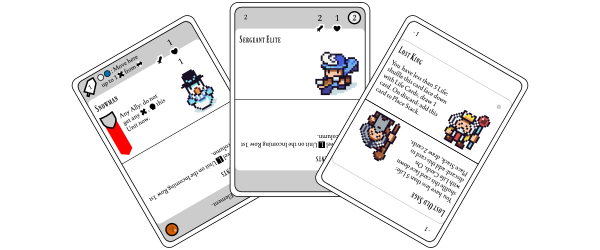

The explorer was frozen in fear: a raging horde was going to invade Stampadia and **there was no hope for the explorer to block it**! It closed its eyes, jumped into the cloud of papers, grabbed some of them, and **ordered the just-born creatures to attack back**. They responded with a nod and entered the fray, defending the exit. A spark of hope lit up the novice general's face.

This is the story of how a humble explorer became a legendary general, **saving Stampadia from destruction**.

## The game

_Generals of Stampadia_ is an open-source print-and-play single-player Expandable Card Game: use the [Print Shop](https://www.kesiev.com/stampadia-generals/printshop.html) to print a core deck of cards and some expansions and play against the Sacred Printer!

It is a fighting card game with a little twist: you're going to fight **randomly generated Units** using a card stacking mechanic... and you're going to use the very same mechanic to **create your customized Units**!

    
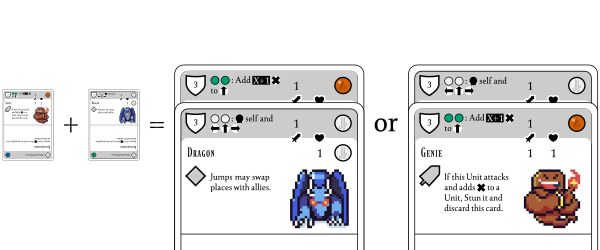

Do you want your **Genie** Unit to **explode on contact**? Combine it with your **Dragon** Unit! Do you want to give your Dragon unit a **defensive debuff** instead? Combine them **backward**!

Do you feel **creative**? Learn [here](tools/README.md) how to **create your own custom card sets** and share them as you want!

### Why?

_Generals of Stampadia_ is way different from the other [Stampadia](https://www.kesiev.com/stampadia-travelers) [chapters](https://www.kesiev.com/stampadia): this new game is not a dungeon crawler and it is not procedurally generated. So why call it _Stampadia_?

All of the Stampadia series games use computer algorithms to create balanced enemies and dungeons, both using weighted element combinations and brute-forcing solutions discarding invalid or unfair scenarios.

GoS embraces instead a more classic _board game-ish approach_ to procedural generation, using simple rules to control randomly selected game elements to do the same. So, in a way, we still have _generated enemies and heroes_ as for ToS - but generated differently.

I _sacrificed_ the dungeon crawling mechanic to experiment with a new feature: using a card layout **simple enough** to let players **create custom cards quite easily** so they can **personalize their random pool** and **share their pool customizations** as _custom card sets_.

    
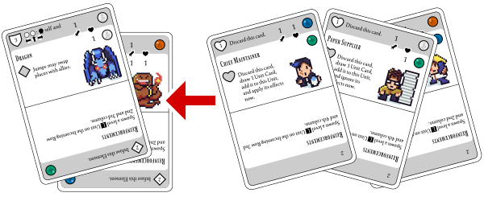

    
I'm going to combine some quite familiar paper suppliers with Dragons and Genies. Because... why not?

GoS key gameplay uses just 1 card type both for **managing the battle events** and **creating player and enemy units**. To customize your deck you've just to **create and print some of them** and **shuffle it in the only game deck**.

Okay. There _is_ another card type with its deck you may add to the game: **Event Cards** can be used as special effects to spice up your game and to add that tiny _narrative layer_ the other Stampadia games have. Get ready to meet and fight aside the original Stampadia cast again - but you can **make your Event Cards too**, so why not create **something weird**?

    
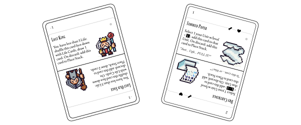

    
In GoS you can save the King from the Sacred Printer... but why not jam it with some ruined paper?

As usual, this game is inspired by many board and video games. Ready for the roundup?

### The project

#### Raging Lanes

The card fighting game landscape is incredibly fascinating: it's a busy world full of tiny mechanics and rules intertwining and remixing each other to create brand new games every time.

For example, let's take a well-established mechanic, like _playing unit cards from your hand, and let them attack the opponent_ and explore a little detail, like how _attackers_ and _defenders_ are decided.

The most recognized procedure is the attacking player _declares the attacking units_ and then the defending player _declares the blocking units_, as our beloved [Magic: The Gathering](https://boardgamegeek.com/boardgame/463/magic-gathering) and a lot of other card fighting games do.

    
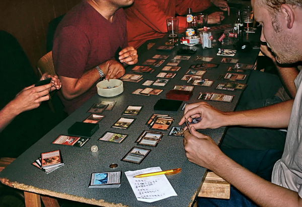

    
People playing the collectible card game Magic: The Gathering. (photo by Andre Engels - <a href='https://creativecommons.org/licenses/by/1.0/'>CC BY 1.0</a>)

In most cases both attacking and blocking units must have been _prepared_ in some way before being involved in a clash, so what's on the battlefield is always _open information_. These two ingredients are enough to create a deep layer of strategy in the opponents' back-and-forth: the attacking player may involve all of its units in a single big attack, involve some of them multiple times, or patiently wait for the opponent to move.

That barely scratches the game's surface: a plethora of special effects, card timings, and the infamous as clever _Stack_ mechanic create enough room for bluffing, backstabbing, and any other cruelty you can commit placing a card on a table.

[Summoner Wars](https://boardgamegeek.com/boardgame/93260/summoner-wars-master-set) instead opted for a more _spacial_ approach: unit cards are moving on a _grid_ and their position and type determine the available attack targets. In this case, the player is in charge of placing and moving its units, but these units will attack _what they can reach_.

    
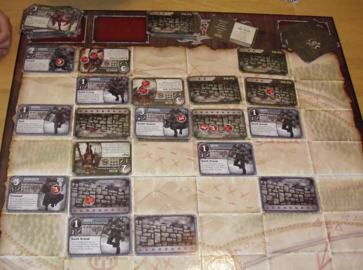

    
Summoner Wars (photo by <a href='https://boardgamegeek.com/image/1046762/summoner-wars-master-set'>Jonan Jello</a>)

With this approach, the game reduces a bit the number of player options, but it gains a huge boost in terms of readability and accessibility.

Some other games prefer _something in the middle_ between the abstractness of the battlefield _a-la Magic_ and the geometries of a _wargame-ish grid_: introducing _the lanes_.

    
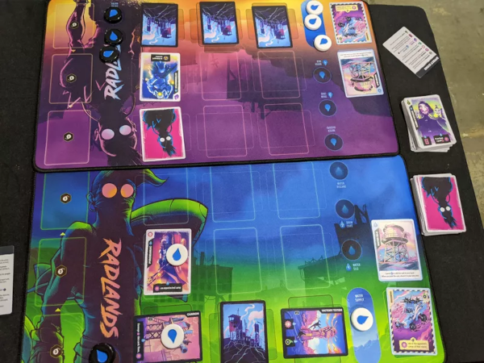

    
Radlands (photo by <a href='https://boardgamegeek.com/image/7226204/radlands'>NasumQSU</a>)

The battlefield is split into multiple lanes, in which the player places its cards. In a battle, the front units on the attacking player side usually attack the front units on the defending player side - but card effects may change this behavior in many twisted ways.

It offers an impressive clarity improvement compared to the abstract battlefield approach and, due to its compactness, it also makes card combos easier to plan (and spot) than with the grid approach.

It's my personal favorite and I have learned to love its flexibility with [Radlands](https://boardgamegeek.com/boardgame/329082/radlands).

I'll take inspiration from it for card management too: Radlands replaces the usual deck-building mechanic with a hand-management one, so both players draw random cards from a shared deck. This feature fits well both Stampadia's _minimal material_ and _roguelite theme_ pillars.

#### Card building

The concept of _composing game components while playing_ is still being explored by modern board games. Some of these experiments have been so loved they became _industry-driving game genres_ (yes, [deck-building genre](https://boardgamegeek.com/boardgamemechanic/2664/deck-bag-and-pool-building), I'm looking at you), some others are precious weird gems for your games collection.

In [Dice Forge](https://boardgamegeek.com/boardgame/194594/dice-forge), for example, the player collects plastic faces to click on their _personalized dice_.

    
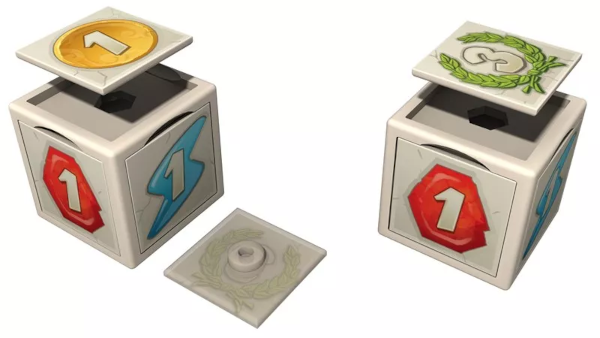

    
Dice Forge (photo by <a href='https://boardgamegeek.com/image/2987203/dice-forge'>Kermit2005</a>)

The tactile nature of its _modular dice_ makes the game interface very straightforward and the limited number of the dice faces offers less complexity and more control than a deck-building game.

It's very enjoyable and intuitive but, after a few games, it started to feel like a deck-building game with _a limited number of cards_.

Don't get me wrong. I'm really happy to have it in my collection but I often find myself playing games of similar complexity... that are _cheaper_ and much easier to get on the table.

So what about a _card-building game_? [Mystic Vale](https://boardgamegeek.com/boardgame/194607/mystic-vale) uses card sleeves and transparent cards to let the player _create their cards_.

    
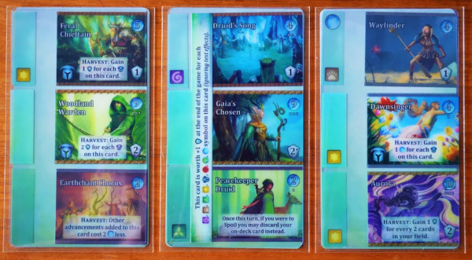

    
Mystic Vale (photo by <a href='https://boardgamegeek.com/image/3088260/mystic-vale'>joakim589</a>)

The player starts with a deck of _almost blank cards_ and purchases transparent _Advancement cards_ to _sleeve into_ from a shared market. It's super weird and, even if it may still be a little pricey game, it feels _different enough_ to join my table from time to time.

But is there a _fighting card game_ that features _card building_ and _lanes_? Oh, _yeah_. And it's a very good one.

    
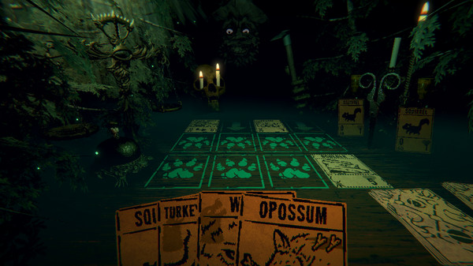

    
Inscryption (screenshot from <a href='https://store.steampowered.com/app/1092790/Inscryption/'>Steam</a>)

[Inscryption](https://www.danielmullinsgames.com/) lives in the _stormy border_ between board games and video games. Part deck-building game, part fighting card game, part roguelite, and part escape room, this game manages to nail the _board gaming feeling_ so well that it left me with no words multiple times.

In the game, the player may collect cards for its deck in many ways, but it can also add _stickers_ to its cards to deeply change their behavior and stats, in a legacy board game _fashion_.

It also introduces an interesting asymmetry in gameplay that allows the _computer opponent_ to work in a simple and yet challenging way: while the player and the computer are playing the same cards, the player must obey multiple _resource economies_ to play them while the bot can do the same with no limits.

This _almighty dummy bot_ mechanic is quite common in many solo or cooperative board games, but it's new and intriguing for me to see this implemented in a card fighting game.

All I was missing was a nice and non-destructive way to implement _card construction_...

    
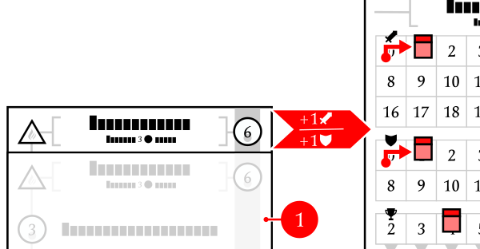

    
In Travelers of Stampadia, you can stack your cards on 4 sides to perform the hero moves!

Luckily I already worked on [something like that](https://github.com/kesiev/stampadia-travelers) and it was time for me to _steal_ as much as I could.

I used the Element infusion mechanic to enable/disable card features and the card stacking mechanic to modularize card powers. Oh, yes. I also stole the project's code and assets.

#### Pixel art

One day someone suggested to me to add the original Chronicles of Stampadia to the [BoardGameGeek](https://boardgamegeek.com/boardgame/345607/chronicles-stampadia) database.

I was _very_ thrilled to do that. For some reason, I _love_ when I'm into something I'm not ready to do. Reaching board gamers all around the world from _the_ board game database with a procedurally generated print-and-play written by a hobbyist player is one of them.

    

The internet is a _holy spring_ of nice words and criticism. The most frequent criticism I received was that the game _was a video game_ because it requires a computer to play.

The Stampadia series games are _computer-generated_ but not _app-driven_ since no computer is needed to _play_ the game - as a _crosswords_ or _sudoku_ grid may be. But I well understand the confusion: the _no digital_ controversy is still lit in board gaming and these differences may be hard to spot.

For the Stampadia series, being an _unholy digital-analog hybrid_ is not only a _design pillar_ but also a _key point of the Stampadia lore and world-building_. The few of you who collected the _Printing Press parts_ in CoS or have met a _Stampadian Guardian_ in ToS may get some hints.

Anyway, this third episode hides the story of how _the Stampadia world transformed from analog to digital_ so - since there is no procedural generation this time - I needed a way to show it. To show how _Stampadians were turned into the abstract digital entities_ you'll meet in Chronicles of Stampadia.

Why do a lot of roguelite video games feature _pixel art_? To provide more content with less effort? To be more readable on screen? To connect _old-school gameplay_ with _old-school style_?

    
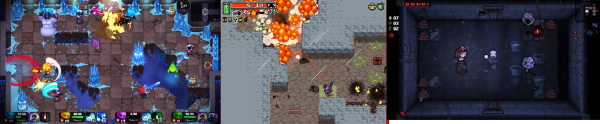

    
From left to right: Ember Knights, Nuclear Throne, and The Binding of Isaac: Rebirth

_(For the record: The Binding of Isaac was originally in vector/Flash style and then "updated" to pixel art!)_

Well. I don't know. But that's what I needed: Stampadians will be _pixelated_ this time. Also, this style allows me to fit the card illustrations as text in card sets data files so you can open them with any text editor and work on them.

I've chosen the super sparkly [PAX-24 color palette](https://lospec.com/palette-list/pax-24) and encoded its colors with letters and numbers. A 24x24 image fits well the (small) space left on the card and keeps the card readable.

And that's it! Thank you for reading this far!

### Font

The game manual and the card packs use the excellent CC0 fonts [Seshat](http://dotcolon.net/font/seshat/) and [Ferrum](https://dotcolon.net/font/ferrum) by Dot Colon. If you're going to have a look at the manual generation tools `assets/manual/` and the card model `svg/model.svg` make sure you have got these fonts installed. A copy of these fonts is included in the `assets` directory.